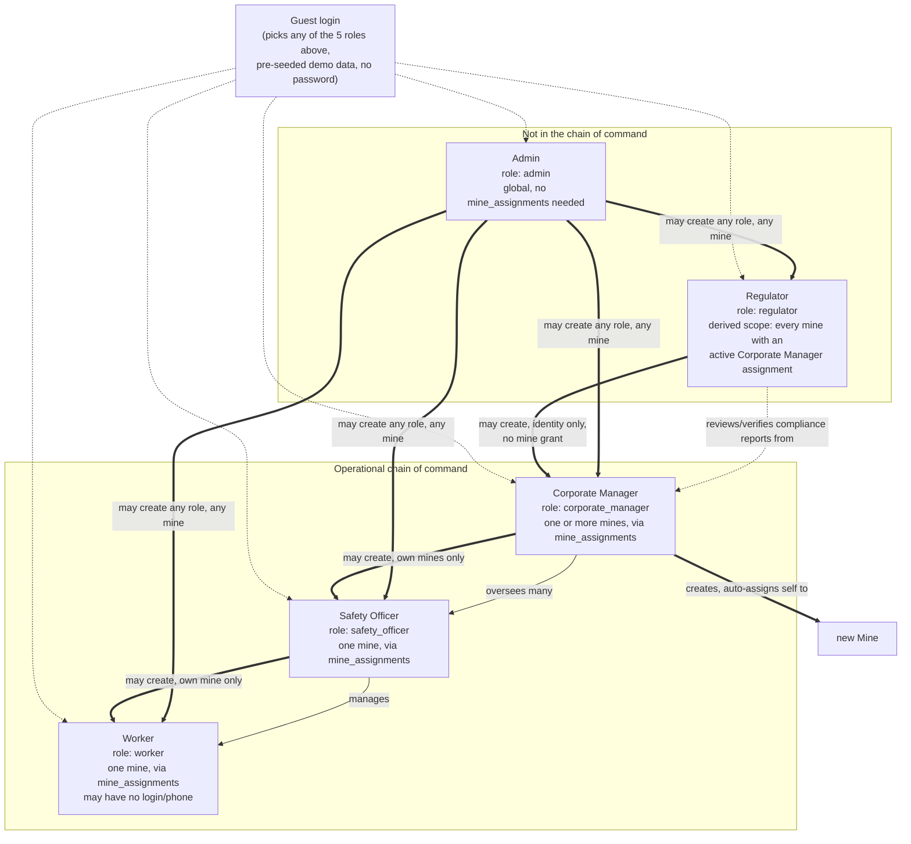
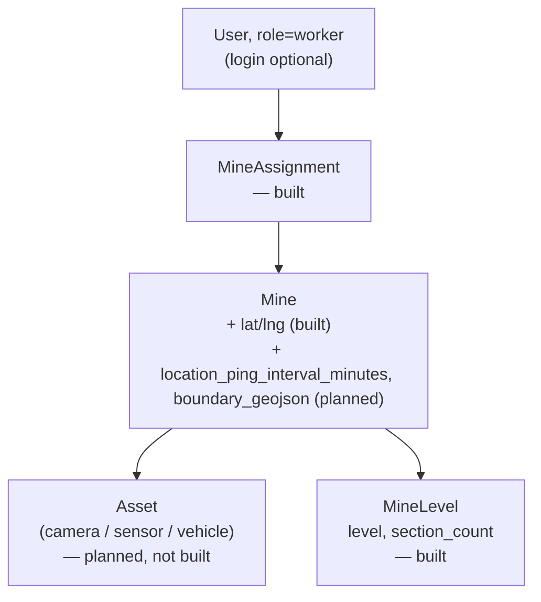

# Low-Level Design — CoalGuard (PS 26024)

> **Last updated:** 2026-09-06 (uncommitted — not yet pushed, exists only in this local working tree) ·
**Status:** CURRENT — source of truth for RBAC, data models, and pages. Reconciled against the real implementation (2026-09-06): sections/fields that were actually built are updated to match reality; everything still unbuilt is left exactly as originally designed, since it remains the target to build toward, not dead content.

Full design reference for the team. Builds on `architecture.md`, `plan.md` (deleted — superseded), `folder_structure.md`, `blockchain_ledger.md`, and `prev_ps.md`. Read this before starting on your part — sections 4–6 are the shared contract everyone codes against; section 7 is the per-feature deep dive. Where a section describes something already built, it says so and points at the real field/route names; where it doesn't, that's still the plan, not something abandoned.

---

## 1. Features We're Building

Grouped by who mostly owns them, but everything ultimately meets in MongoDB and the `backend` API. ✅ marks what's actually implemented today; everything else here is still the target.

**Identity & access**
- ✅ Email/password login and guest login (pick a role, explore with seeded demo data). Google OAuth login is built on both ends but currently switched off in the frontend UI pending a real OAuth Client ID, see `research/saumy/02-google-auth-deferred.md`.
- ✅ Role-based access control — 5 roles (see §3), now via a `role` field plus a separate `mine_assignments` collection recording where that role applies (not bundled onto the user document or the JWT the way originally sketched — see §3).

**Field operations**
- Worker attendance — camera-based (face recognition at pit-entry cameras) or manually recorded by the Mine Safety Officer for workers without a phone. **Not built.**
- Worker location tracking — periodic GPS ping while checked in, interval configurable per mine (default 5 min). **Not built.**
- ✅ Inspections & observations (partial) — the offline-capable "New Inspection" flow (`/worker`, geo + timestamp, photos, voice notes, offline queue + auto-sync) is built and live. Multilingual speech-to-text transcription of the voice note is **not built** — the audio is captured and stored, not transcribed.
- ✅ Issue raising & detection (replaces the original CAPA "ticket" framing at the raising/detection stage) — a Worker can report a site problem manually, and both PPE and sensor-anomaly detection auto-raise an issue. See §4/§7f for exactly how this differs from the CAPA lifecycle below.
- CAPA ticket lifecycle — open → in_progress → resolved, with escalation on SLA breach; tickets created automatically (from a Violation or PPE detection) or manually by a Mine Safety Officer. **Not built** — today an issue is just `open`/`resolved`, with no assignment, SLA, or escalation. This remains the target for a richer workflow; see §7f.
- Live voice chat between a Worker and their Mine Safety Officer for real-time field communication. **Not built.**
- Global search across mines, tickets, inspections, and workers. **Not built** — a UI shell for this existed briefly (`GlobalSearchModal.tsx`) but was removed since it had no real backend behind it; still a legitimate future feature, see §7r.

**Live monitoring**
- WebSocket telemetry simulator — simulated IoT sensor stream (methane/CO ppm, air velocity, temperature, roof bolt tension, conveyor speed, vehicle movement), including a live gas-leak simulation. **Not built.** A one-shot (not streaming) version of the anomaly-check exists today — see §7g.
- GIS mine map — 2D Leaflet, hazard pins, risk heatmap, EC boundary, live worker positions. **Not built as GIS.** A schematic (non-geographic) per-level section view exists today — see §7h.
- ✅ PPE compliance scanner — YOLOv8 detects missing hardhats/vests from an uploaded image and auto-creates a `PersonIssue` (see §4/§7j) — wired and working, though it checks one uploaded image on request rather than a continuous camera feed.

**Intelligence**
- RAG legal compliance engine — DGMS/CPCB/CMR2017 rulebooks vectorized in ChromaDB; a chat interface answers compliance questions with a cited rule number; auto-maps flagged observations to the matching rule. **Built in `ai_engine`, not yet called by `backend`** — see §7i, unchanged from the original plan's own note that this wiring was still pending.
- ✅ Predictive analytics (partial) — the anomaly-detection half (`IsolationForest` + hard thresholds on a sensor snapshot) is built and wired: it's what turns a bad reading into a `SiteIssue` (§7l point 1). Historical-log anomaly detection, EC extraction-cap breach forecasting, and the spatial risk heatmap (§7l point 2) remain **not built/not wired** — `ai_engine`'s forecasting endpoint exists but nothing in `backend` calls it yet.
- OCR document digitization — legacy paper logbooks/attendance sheets digitized via EasyOCR/Tesseract. **Not built.**

**Automation & integrity**
- n8n automated workflows — dispatches SMS/WhatsApp/email on high-severity tickets, escalates unresolved tickets past their SLA, emails scheduled compliance reports. **Not built.**
- Cryptographic audit ledger — SHA-256 hash of each ticket/inspection written to a Solidity smart contract on a public testnet. **Not built** — explicitly deferred to backlog per `research/saumy/09-changes-5-sep.md` Decision #13's Phase 7 trim, in favor of shipping the simpler report/verification workflow first (§4 `RegulatoryReport`, §7m).
- Compliance certificates — generated per mine, with a QR code for verification and a valid/expired/under-review status. **Not built.** A different, simpler oversight mechanism (`RegulatoryReport`) ships in the meantime — see §4/§7s.

**Governance dashboards**
- ✅ Real per-role dashboards now exist for all 5 roles, each with its own route tree (see §6 for the exact pages) — reshaped from "one dashboard route, content varies by role" to a real URL per page, per Decision #16. Safety Officer's is single-mine; Corporate's is multi-mine aggregate (issues only, not yet production/compliance-score); Regulatory's is read-only cross-mine oversight of reports; Admin's covers user/mine/access provisioning, not yet system health.

---

## 2. Tech Stack

| Layer | Choice |
| --- | --- |
| Frontend | React + Vite + TypeScript, Tailwind CSS (v4), Zustand (state), React Router. Apache ECharts and Leaflet/react-leaflet are still the planned choices for charts/GIS once those features are built — not in use yet. |
| Backend API | Python, FastAPI, Uvicorn, WebSockets (WebSocket support not yet used by any endpoint — no telemetry/notification stream exists yet) |
| Backend ODM | Beanie (async ODM over Motor/PyMongo) |
| Auth | `python-jose` (JWT), `passlib[bcrypt]` (local passwords), Google OAuth (ID token verification, built, disabled in the UI) |
| Primary DB | MongoDB 7 |
| Offline queue | `idb` (IndexedDB) — used by the Worker's `/worker` inspection flow |
| Cache / pub-sub | Redis — planned, not yet wired into anything running |
| Vector DB | ChromaDB — in use inside `ai_engine` for RAG, not yet surfaced to any `backend` endpoint |
| AI/RAG | LangChain (`langchain-chroma`, `langchain-groq`), HuggingFace `sentence-transformers` (`all-MiniLM-L6-v2`, CPU), Groq Cloud — **built in `ai_engine`**, see §7i; not called by `backend` yet |
| Predictive Analytics | scikit-learn `IsolationForest` (anomaly detection) — **built and wired** (§7l point 1); NumPy/pandas linear-trend regression (production forecasting) — **built in `ai_engine`, not wired** (§7l point 2) |
| Computer Vision | YOLOv8 (Ultralytics), OpenCV, PyTorch (CPU-only) — **built and wired**, see §7j |
| OCR | EasyOCR / Tesseract — planned, not started |
| Voice / Speech | Web Speech API or Bhashini/Sarvam AI for multilingual voice notes; a live Worker↔Officer voice/text chat channel — planned, not started (voice notes are captured today but not transcribed) |
| Workflow automation | n8n — planned, not started |
| Blockchain | Solidity + Hardhat, `web3.py`, Polygon testnet — planned, not started; deferred behind the simpler `RegulatoryReport` workflow for now (§7m) |
| Infra | Docker + Docker Compose (BuildKit cache mounts, hot-reload volumes for local dev); VPS/Oracle Cloud + Vercel deployment — still the plan, not yet done |

`backend` and `ai_engine` are deliberately separate services/containers — the web backend (users, auth, issues) needs to stay light and responsive; PyTorch/YOLOv8/LangChain are heavy and CPU-blocking, so they live in `ai_engine` and get called over HTTP. Today only two of `ai_engine`'s endpoints are actually called from `backend`: PPE detection and anomaly detection (see §5).

---

## 3. User Roles (RBAC)

5 roles, one dashboard/scope each — guest login (§7a) covers demo access, so there's no separate evaluator/demo role. Role names were shortened during implementation; the mapping is:

| Role (`User.role` today) | Original name | Scope | Key features |
| --- | --- | --- | --- |
| **`worker`** | Worker | Assigned mine, via one active `MineAssignment` (§4) | Log inspections/observations, voice-to-text notes *(capture only — no transcription yet)*, offline queue + auto-sync, personal open-issue warning, report a site problem |
| **`safety_officer`** | Mine Safety Officer | One mine, via one active `MineAssignment` | Combined Safety Issues queue (Site + Person), Mine Map, create Workers scoped to their own mine |
| **`corporate_manager`** | Corporate Management | One or more mines, via one `MineAssignment` per mine | Cross-mine safety-issue overview, submit compliance reports, create Safety Officers + new Mines (auto-assigns creator) scoped to their own mines |
| **`regulator`** | Regulatory Authority | **Derived, not assigned** (see below) | Aggregate KPIs, per-mine compliance status, review/verify Corporate reports, create Corporate Management accounts |
| **`admin`** | Admin | Global — no `MineAssignment` needed | Create any role/mine, change any user's role, grant/revoke mine assignments |

Live telemetry/camera feeds, ticket assign/resolve, manual Worker check-in/out, financial penalty metrics, blockchain hash verification, and system-wide onboarding UI beyond user/mine/access provisioning remain **not built** — see §1/§7 for exactly what each role's dashboard covers today versus the original design.

### Scope model: `mine_assignments`, not `mine_id`/`subsidiary_id` on the user

The original design put `mine_id`/`subsidiary_id` directly on `User` and baked them into the JWT (see the old Auth subsection below, still true for the *shape* of the claim but not its contents). That doesn't hold up once a Corporate Manager can have more than one mine, or a mine can have more than one manager. The real scope model is a separate collection:

```
mine_assignments
  user_id
  mine_id
  role        # mirrors the user's role at assignment time
  active
  assigned_at
  revoked_at (optional)
```

`User.mine_id`/`User.subsidiary_id` still exist on the document but are legacy and unused by any route — kept only until every caller has migrated off them (`research/saumy/09-changes-5-sep.md` Decision #12's rollout sequence).

**Regulator's scope is a deliberate, temporary simplification.** The real-world body this role represents (India's DGMS) has 8 zones and 38 regional offices — multiple independent regulator accounts is the realistic long-term shape. For now, this platform assumes **exactly one Regulatory Authority account exists**, so a regulator's accessible mines are computed as *every mine with an active Corporate Management assignment*, with no `MineAssignment` of its own. This breaks the moment a second regulator exists; the fix — a `regulator_assignments` collection linking regulator↔corporate-manager, matching the delegation hierarchy below — is deferred until then (Decision #13's "Regulator scope" note).

### Delegation hierarchy (who may create whom)

New since the original design, and enforced server-side as a strict allow-list (`backend/src/services/provision_service.py`), not just a UI convention:

```
Admin              → any role, any mine
Regulatory         → Corporate Management only (no mine grant — creates the identity, not access)
Corporate Manager  → Safety Officer (must be one of their own mines) + new Mine (auto-assigns creator)
Safety Officer     → Worker (must be one of their own mines)
```

No role may create a peer or a superior. An admin cannot change their own role (self-escalation blocked) or demote the platform's last active admin. Mine registration still needs its original follow-up decision: a mine created by a Corporate user is immediately in that corporate user's scope, but under today's one-regulator simplification above it becomes visible to the Regulator automatically (no separate acceptance step yet, unlike the original "explicit regulator assignment" design — revisit once `regulator_assignments` exists).

### Role hierarchy



Solid thin arrows = the real operational chain of command. Dotted arrows = oversight/login relationships outside that chain — a regulator reviews Corporate's reports but manages no one operationally, Guest is a login mechanic rather than a role of its own. Thick (`==>`) arrows are the delegated **provisioning** hierarchy — who may create whom — a separate relationship from the operational chain above: Corporate oversees Safety Officer operationally *and* is who creates their account, but Regulatory reviews Corporate's reports while having no hand in the operational chain at all, only in provisioning Corporate's identity.

### Auth

JWT (`python-jose`) claims are now just `sub` (user id) and `role` — **no scope claims**. The original design's `user_type` + `mine_id`/`subsidiary_id` claims are gone: scope is looked up from `mine_assignments` on every request that needs it (via `accessible_mine_ids(user)`/`require_mine_assignment(user)` in `auth/dependencies.py`), never trusted from the token. `passlib[bcrypt]` for local password hashing. Three ways to obtain a token:
- **In-house**: email/password against `User.password_hash`.
- **Google OAuth**: frontend gets a Google ID token, backend verifies it and matches an existing invited `User.email` (does not self-provision a new account for an unrecognized email — an Admin must invite first, see §7p). Built on both ends, but the frontend button is currently disabled by a flag pending a real OAuth Client ID — see `research/saumy/02-google-auth-deferred.md`.
- **Guest**: "continue as guest" logs into a pre-seeded demo `User` for whichever role is picked. Guest accounts have no email/phone/password at all — reachable only from the Landing page, never the normal login form.

A phone-less Worker has no `password_hash`/`google_id` and simply can't authenticate — they still exist as a full document so attendance, tickets, and certifications can reference them, and the Mine Safety Officer acts on their behalf for check-in/out. *(Still true by design; the attendance/check-in-out feature itself isn't built yet, so nothing exercises this today.)*

`get_current_user` (a FastAPI dependency used by every protected route) rejects with `401` if the user isn't found or `active` is `False` — this is the real enforcement point for account deactivation, not a separate middleware. Every service function that needs mine scope takes it as a required, server-resolved argument rather than trusting a client-supplied `mine_id` in the request body/query — this is what makes RBAC enforcement structural instead of a checklist, same principle as originally designed, just resolved from `mine_assignments` instead of the token.

*(`has_login`, a field from the original design meant to distinguish guest from real accounts, was removed from `User` — it was write-only and never actually read by any check; `active` already does the real enforcement work described above.)*

---

## 4. MongoDB Models (Beanie Documents)

Hierarchy: `Mine -> {Asset, MineLevel, User (via MineAssignment)}`. The `Asset` link is still aspirational (§4 below); `MineLevel` is new. `Subsidiary` (the original org layer above `Mine`) is dropped from the design as of this reconciliation — see the note under `Mine` below for why and what's actually still in the database.

`Worker` is **not** a separate collection from `User` — a Worker is just a `User` with `role="worker"`. Some Workers have no phone and never log in, but still need a real document to attach attendance, certifications, and issue reports to. One collection avoids syncing two records for the same person.



### Org & identity
- **`Mine`** — `boundary_geojson`, `ec_annual_cap_tonnes`, `ec_monthly_cap_tonnes`, `location_ping_interval_minutes` (int, default `5`, editable by the mine's Safety Officer) — **all still planned, not built.** ✅ What exists today: `name` (required — not just planned, this is live and used everywhere a mine is created/seeded/returned), plus `lat`/`lng` (both nullable, added only so the Regulator's Mines page has a coordinate to show per assigned mine — not a real registry yet). `GET /mines` (role-scoped list) exists alongside `POST /mines` (§7b).
  - **Dropped from the design: `Subsidiary`** (the org layer originally above `Mine`, e.g. SECL/CIL) and `Mine.subsidiary_id`/`User.subsidiary_id`. Decision #11 (`research/saumy/09-changes-5-sep.md`) rejected subsidiary-based scoping outright — Corporate Management scope is `mine_assignments`-based instead (§3), and nothing reads `subsidiary_id` for any authorization or query today. **Checked against the actual code (2026-09-06): the `Subsidiary` collection and both `subsidiary_id` fields still physically exist in the codebase and database** — `org_service.py` still creates a placeholder `Subsidiary` document and seed scripts still populate `subsidiary_id` on Corporate accounts — but purely as unused legacy writes, not part of the design going forward. Deleting the model/fields outright (rather than leaving them as dead weight) is a reasonable next cleanup step whenever someone picks it up; nothing depends on them. The same relic also sits one layer further out than previously noted: `CreateUserRequest` (the `POST /users` request schema) still declares a `subsidiary_id` field that `provision_service.provision_user` never even reads — dead all the way from the API surface down, not just on the stored documents.
- **`Asset`** — `mine_id`, `type` (camera / sensor / vehicle / conveyor), `label`, `install_date`, `last_maintenance_at`. **Not built.**
- **`MineLevel`** *(new, not in the original design)* — `mine_id`, `level` (a letter, e.g. `"A"`), `section_count` (int). No shape/geometry data — the Mine Map (§7h) generates a schematic Voronoi illustration from this count client-side, purely for visual variety, not a real layout. Built.
- **`User`** — `email` (nullable), `phone` (nullable — phone-less Workers have neither; login accepts either as the identifier), `password_hash` (nullable), `google_id` (nullable), `role` (renamed from `user_type`, shortened values — see §3), `mine_id`/`subsidiary_id` (nullable, **legacy/unused**, kept only until every caller migrates), `full_name`, `role_title` (Workers only), `is_guest`, `active`. (`has_login` from the original design was removed — see §3's Auth note.)
- **`MineAssignment`** *(new, not in the original design)* — `user_id`, `mine_id`, `role` (mirrors the user's role at assignment time), `active`, `assigned_at`, `revoked_at` (nullable). This is what §3's scope model actually runs on. Built, with a real `GET`/`POST`/`DELETE /mine-assignments` route trio (list-by-user, grant, revoke) — `DELETE` is a soft-delete (`active=False` + `revoked_at` set, the document isn't actually removed), not a hard delete.

### Telemetry, CV & attendance
- **`TelemetryReading`** — `mine_id`, `asset_id`, `sensor_type` (methane / co / air_velocity / aqi / noise / water_ph / temperature / roof_bolt_tension / conveyor_speed), `value`, `unit`, `recorded_at` — high-volume, index on `(mine_id, sensor_type, recorded_at)`. **Not built** — see §7g for what exists instead (a one-shot anomaly check, not a stored stream).
- **`PPEDetectionEvent`** — `camera_asset_id`, `mine_id`, `missing_ppe: [str]`, `confidence`, `image_url`, `detected_at`, `linked_ticket_id`. **Not built as its own collection** — today a detected violation is written directly as a `PersonIssue` with `source="camera"` (see below), which is simpler but loses this model's richer per-camera/confidence tracking. Revisit if that richer tracking turns out to matter. One real business rule this simpler path bakes in, worth knowing: `PersonIssue.issue_type` is single-valued, so if a detection finds *both* helmet and vest missing at once, the service forces `issue_type="no_helmet"` — helmet is treated as the more severe DGMS violation, not a design gap.
- **`LocationPing`** — `mine_id`, `worker_id` (`User._id`), `lat`, `lng`, `recorded_at` — one row every `Mine.location_ping_interval_minutes`, only while checked in; powers the live "where is everyone" layer on `MineMap`. **Not built.**

### Inspections & issue tracking
- **`Inspection`** — `mine_id` (nullable), `source` (manual / sensor / cv — only `manual` is produced today), `worker_id` (`User._id`, always a Worker with a login), `observations: [Observation]` (embedded: `description`, `photo_urls`, `voice_note_url`, `lat`, `lng`, `pillar`, `captured_at` — when the Worker actually captured it, which can predate `Inspection.created_at` if it sat queued offline before syncing), `created_at`. ✅ Built and live — this is the Worker's offline-capable `/worker` inspection-capture flow specifically. One `Observation` per `Inspection` in practice today; the array shape leaves room for a future flow that batches multiple observations into one session, which nothing currently does. Note the read side is thin: there's no `GET /inspections`/`GET /inspections/{id}` at all, and even the one existing response (`POST /inspections/observations`'s reply) omits `observations` entirely — see §6's `Inspections`/`InspectionDetail` "Not built" note, which already covers this.
- **`Violation`** — `inspection_id` or observation index, `pillar`, `compliance_status` (from `ai_engine`'s RAG), `analysis`, `citations`, `applicable_regulations`, `created_at`. **Superseded, not just unbuilt** — during implementation this was deliberately replaced by two scope-split collections below, because a single generic "violation" record didn't cleanly separate "about one worker" from "about the mine itself." If a rule-compliance record with RAG citations is wanted later, it would sit alongside `PersonIssue`/`SiteIssue`, not resurrect this exact shape.
  - **`PersonIssue`** *(replaces `Violation` for worker-specific issues)* — `worker_id` (nullable — null when a camera detection can't resolve identity), `mine_id`, `level`, `section`, `issue_type` (`no_helmet` / `no_vest` / `unsafe_practice` / `other`), `source` (`camera` / `manual`), `observation`, `photo_url`, `severity` (`low`/`medium`/`high`/`critical`), `status` (`open`/`resolved`), `created_at`. Built.
  - **`SiteIssue`** *(replaces `Violation` for mine/asset-level issues)* — `mine_id`, `level`, `section`, `issue_type` (`high_methane` / `high_co` / `low_ventilation` / `high_temperature` / `equipment_fault` / `other`), `source` (`sensor` / `manual`), `observation`, `sensor_reading_snapshot` (nullable, raw per-sensor detail from the anomaly check), `severity` (`NORMAL`/`WARNING`/`CRITICAL` — `ai_engine`'s own vocabulary, a different scale from `PersonIssue`'s on purpose), `recommended_action` (nullable), `status`, `created_at`. Built. **Known gap, unlike `PersonIssue`: no `photo_url` field at all.** `WorkerReportPage`'s "Add Photo" button (`/dashboard/worker/report`) shows a "Photo Attached ✓" success state in the UI, but nothing about it is ever sent to `POST /site-issues` — there's no field on `CreateSiteIssueRequest`/`SiteIssue` to put it in. This is a real false affordance (the Worker is told a photo was attached when it silently goes nowhere), not just a documentation gap — fix by either adding a real `photo_url` here (mirroring `PersonIssue`) or removing the button until one exists.
  - `pillar` was dropped from both — it was "misapplied" for this purpose (meant for physical mine-pillar structures, not a compliance category); it survives only on `Inspection.observations[].pillar` above.
- **`Ticket`** (CAPA) — `mine_id`, `source` (violation / cv_detection / manual), `violation_id` (nullable), `created_by` (nullable `User._id`), `severity`, `status` (open/in_progress/resolved/escalated), `assigned_to` (`User._id`, nullable), `sla_deadline`, `resolution_photo_urls`, `resolution_notes`, `resolved_by`, `escalation_history: [ {to, at} ]`, `comments: [ {author_id, text, at} ]`. **Not built.** `PersonIssue`/`SiteIssue`'s `status: open/resolved` today is a much lighter stand-in with no assignment, SLA, or escalation — this richer lifecycle remains the actual target once someone builds it; see §7f.

### Production, environment, labour & attendance logs
- **`ProductionLog`** — `mine_id`, `date`, `extracted_tonnes`. **Not built.**
- **`EnvironmentLog`** — `mine_id`, `date`, `aqi`, `noise_db`, `water_discharge_ph`, `dust_suppression_runs`, `topsoil_preservation_pct`. **Not built.**
- **`LabourShift`** (doubles as the attendance record) — `worker_id`, `mine_id`, `check_in_at`, `check_in_method` (camera / manual), `check_in_camera_asset_id` (nullable), `check_in_confidence` (nullable), `check_in_recorded_by` (nullable `User._id`), `check_out_at`, `check_out_method`, `check_out_recorded_by`, `rest_period_ok: bool`. **Not built.**
- **`HealthCheckup`** — `worker_id`, `date`, `result`, `next_due_at`. **Not built.**

### Integrity, automation, misc
- **`AuditLedgerEntry`** — `ticket_id` or `inspection_id`, `report_hash` (SHA-256), `tx_hash`, `block_number`, `chain` (polygon-testnet), `logged_at`. **Not built** — deferred per §1; see `RegulatoryReport` below for what ships in the meantime.
- **`AlertLog`** — `ticket_id`, `channel` (sms/whatsapp/email), `recipient`, `sent_at`, `escalation_level`. **Not built.**
- **`ScheduledReport`** — `mine_id` (or a list of mine ids, for a Corporate Manager's multi-mine summary — no `subsidiary_id` grouping; that concept is dropped, see `Mine`'s note above), `template` (daily_shift / weekly_compliance / monthly_environmental / quarterly_safety / annual_statutory), `period_start`, `period_end`, `pdf_url`, `recipients`, `generated_at`. **Not built.**
- **`OCRDocument`** — `mine_id`, `doc_type` (logbook/attendance), `raw_image_url`, `extracted_text`, `uploaded_by`, `uploaded_at`. **Not built.**
- **`ComplianceCertificate`** — `mine_id`, `pillar`, `status` (valid/expired/under_review), `issued_at`, `expires_at`, `qr_code_url`, `document_url`. **Not built.** See `RegulatoryReport` immediately below for the simpler mechanism that ships in the meantime — they're not the same thing (a certificate is a standing per-pillar credential; a report is a periodic submission-and-review record), and both may end up existing eventually.
- **`RegulatoryReport`** *(new, not in the original design)* — `mine_id`, `reporting_period` (free-text label, not a real date-range filter yet), `report_type` (`corporate_submission` / `regulatory_verification`), `status` (`submitted`/`under_review`/`verified`/`disputed`), `parent_report_id` (nullable — links a verification to what it responds to), `submitted_by_user_id`, `submitted_at`, `total_safety_issues`/`critical_issues`/`resolved_issues` (server-computed from real `PersonIssue`/`SiteIssue` at submission time, never client-supplied), `average_resolution_time_hours` (nullable, corporate-declared only — no real CAPA workflow exists yet to measure it), `notes`. **Never mutated after creation** — a verification is always a new document; "current status" for a mine+period is derived by picking the most recent report in its chain, not stored. Built — this is Decision #13's trimmed first slice of the regulator-oversight workflow. `regulatory_actions`/`regulatory_action_evidence` (the formal-notice/evidence layer on top of this) remain **not built**, same deferred-backlog status as the audit ledger. `POST /regulatory-reports/{id}/respond` enforces a real transition rule not visible on the model itself: it refuses (400) unless the target is specifically a `corporate_submission` — a regulator can't respond to another regulator's own verification.

---

## 5. Backend (`backend/src`)

```
backend/src/
├── routes/         # FastAPI route/endpoint definitions — thin, validate input, call a service, return
├── schemas/        # Pydantic request/response DTOs — distinct from models/, these aren't DB documents
├── models/         # Beanie Documents from §4, one file per collection
├── services/       # business logic — every query here filters by caller's resolved mine scope
├── websockets/      # telemetry simulator + broadcaster, notification push — planned, not built; no WebSocket endpoint exists yet
├── auth/           # JWT issuance/verification, Google OAuth verification, guest login, RBAC dependencies, delegation-hierarchy enforcement (provision_service.py)
└── main.py         # FastAPI app, lifespan (Mongo connection), router registration
```

**Auth flow**: `get_current_user` decodes the JWT and loads the `User` document; `require_role(*roles)` gates a route by role; `accessible_mine_ids(user)`/`require_mine_assignment(user)` (both in `auth/dependencies.py`) resolve scope from `mine_assignments` at request time, not from a token claim (see §3's Auth note for why this differs from the original plan). Every service function that needs mine scope takes it as a required argument rather than trusting a client-supplied `mine_id` in the request body/query — this is what makes RBAC enforcement structural instead of a checklist, exactly the original design goal, just resolved differently.

**Cross-service calls** (`backend` never runs heavy AI code itself):
- ✅ `ai_engine` — **two of its endpoints are actually called today**: `POST /api/cv/detect` (PPE detection → `PersonIssue`, §7j) and `POST /api/predictive/anomaly` (sensor anomaly → `SiteIssue`, §7l point 1), both plain `httpx` calls from `services/ai_engine_client.py`. RAG (`/api/rag/check-compliance`, §7i) and the forecasting endpoint (`/api/predictive/forecast`, §7l point 2) are built in `ai_engine` but have **no caller in `backend` yet** — still the plan, not wired.
- `n8n` — `backend` fires a webhook (ticket created/escalated) with the ticket payload; n8n owns the actual SMS/WhatsApp/email/escalation logic. **Not built** (no `Ticket` model to trigger it yet either, §4).
- Blockchain — `backend/src/services/audit.py` computes the SHA-256 hash and calls `web3.py` against the Hardhat-deployed contract's ABI, then writes the resulting `tx_hash`/`block_number` into `AuditLedgerEntry`. **Not built** — deferred, see §1/§4.

**WebSockets**: one endpoint streams simulated `TelemetryReading`s per mine (including the gas-leak simulation spike), another pushes ticket/alert notifications to connected dashboards. Redis pub/sub is the fan-out mechanism if more than one backend replica is ever running. **Not built** — no WebSocket endpoint exists in `backend` today.

**Background/scheduled work**: `ScheduledReport` generation and SLA-escalation checks run as periodic jobs (APScheduler in-process, or an n8n cron trigger calling a backend endpoint). **Not built** — no background job runner exists yet.

---

## 6. Frontend Pages (`frontend/src`)

The original design used one `/dashboard` route per role with content varying by role. That was replaced during implementation with a real route tree — one URL per page, refreshable/bookmarkable, decided in `research/saumy/09-changes-5-sep.md` Decision #16. ✅ marks what's live today; the rest of this section is unchanged from the original plan and remains the target.

**Landing**
- ✅ `Landing` (`/`) — pre-login role picker → guest login, links into `Login`

**Auth**
- ✅ `Login` (`/login`) — email/password, Google OAuth (button present, disabled by flag), demo-account list. Guest role picker lives on `Landing` instead.

**Shared shell** — role-aware sidebar/topbar. Notifications dropdown (WebSocket-driven) and global search were prototyped as mock UI and then removed (no real backend behind either) — **not built for real yet**, see §1.

**Dashboards — now real per-role route trees, not one shared route:**

- ✅ **Worker** — `/dashboard/worker` (personal open-issue warning), `/dashboard/worker/report` (report a site problem + recent site issues), `/dashboard/worker/map`, `/dashboard/worker/profile` (read-only identity). Separately, `/worker` is the offline-capable inspection-capture flow (`NewInspection` equivalent), kept as its own full-bleed page rather than folded into the dashboard.
- ✅ **Safety Officer** — `/dashboard/safety` (overview: open Site/Person issue counts, severity banner), `/dashboard/safety/issues` (combined Safety Issues queue, severity-first), `/dashboard/safety/map`, `/dashboard/safety/profile`.
- ✅ **Corporate** (partial) — `/dashboard/corporate` (cross-mine safety-issue overview + queue, assigned mines only), `/dashboard/corporate/reports` (submit a compliance report, see the response thread), `/dashboard/corporate/profile`. Multi-mine aggregate KPIs beyond issue counts (production, compliance score, ESG) are **not built**.
- ✅ **Regulatory** (partial) — `/dashboard/regulatory` (aggregate KPIs), `/dashboard/regulatory/mines` (one card per assigned mine — not a map), `/dashboard/regulatory/compliance` (current status per mine + respond action), `/dashboard/regulatory/reports` (full report/verification thread), `/dashboard/regulatory/profile`. Read-only cross-mine audit view beyond the report workflow is **not built**.
- ✅ **Admin** (partial) — `/dashboard/admin/users` (real directory + provisioning form), `/dashboard/admin/mines` (mine registry list + create), `/dashboard/admin/access` (role change + mine-assignment grant/revoke), `/dashboard/admin/profile`. System health monitoring is **not built**.

**Operations**
- `MineMap` — Leaflet GIS (2D): hazard pins, risk heatmap, EC boundary, live worker positions. **Not built as GIS** — ✅ a schematic per-level section view exists at `/dashboard/{worker,safety}/map` instead (§7h).
- `LiveTelemetry` — real-time charts per sensor type (WebSocket). **Not built.**
- `Tickets` — CAPA board (kanban by status), filterable by mine/severity/pillar. **Not built** — ✅ the Safety Issues queue (`/dashboard/safety/issues`) and Corporate's issue overview are a read-only stand-in with no kanban/workflow.
- `TicketDetail` — violation + citation, assignment, proof upload, sign-off, escalation history, comment thread. **Not built.**
- `NewTicket` — Mine Safety Officer manually files a ticket. **Not built** — ✅ a Worker can report a site problem directly (`/dashboard/worker/report`) instead.
- `Inspections` / `InspectionDetail` — list, filter, detail view of past inspections. **Not built** (the `Inspection` documents exist, §4, but there's no page listing them yet).
- ✅ `NewInspection` — mobile-first form, offline-capable. Built as `/worker` (`WorkerApp.tsx`).
- `PPEAlerts` — CV detection feed with camera snapshots. **Not built** — detections land in the Safety Issues queue as `PersonIssue`s instead, with no dedicated feed/snapshot view.
- `Attendance` — check-in/out per Worker, manual check-in for phone-less Workers, ping-interval setting. **Not built.**

**Compliance**
- `ComplianceOverview` — four pillar tabs. **Not built.**
- `ProductionVsCap` — extraction trend vs EC caps, 30-day breach forecast. **Not built** (`ai_engine`'s forecasting endpoint exists but isn't called, §5).
- `EnvironmentLogs` — AQI/noise/water/dust history. **Not built.**
- `Labour` — shifts, rest-period compliance, certifications, health checkups. **Not built.**
- `LegalAssistant` — RAG chat. **Not built** — `ai_engine`'s RAG endpoint exists but has no frontend page calling it (§7i).

**Integrity & reporting**
- `AuditLedger` — verify a ticket's hash against the on-chain record. **Not built.**
- `Certificates` — compliance certificates per mine/pillar, QR verification. **Not built** — ✅ `/dashboard/regulatory/reports` and `/dashboard/corporate/reports` cover a simpler version of "prove compliance was reported and reviewed" in the meantime (§4 `RegulatoryReport`).
- `Reports` — scheduled report history by template, download. **Not built.**

**Admin / management**
- ✅ `Users` (`/dashboard/admin/users`) — provisioning form + real directory, now through the delegation hierarchy (§3), not just Admin-only as originally scoped.
- ✅ `Mines` (`/dashboard/admin/mines`) — create/list mines (name + optional lat/lng only — not the full boundary/asset CRUD originally planned).
- `SystemHealth` — Docker/Redis/MongoDB connection status. **Not built.**
- `Settings` — profile, password, language preference. **Not built.**

**Mobile (PWA) specific**
- `SyncStatus` — offline inspection queue, pending upload count. **Not built as its own page** — the `/worker` flow shows sync status inline rather than as a separate page.

---

## 7. Features Explained in Detail

### a) Login / Auth
Three entry points on `Login`/`Landing`, all producing the same JWT shape:
1. **Email/password** — `POST /auth/login`, backend verifies against `passlib` bcrypt hash, issues a JWT with `sub`/`role` claims (✅ no `mine_id`/`subsidiary_id` claim anymore — see §3).
2. **Google OAuth** — frontend runs Google's sign-in flow, gets an ID token, sends it to `POST /auth/google`; backend verifies the token's signature against Google's public keys and matches an existing `User.email` (an Admin must have already invited that email — see §7p; an unrecognized email is rejected, not auto-created). **Currently disabled in the frontend** (`GOOGLE_AUTH_ENABLED = false` in `Login.tsx`) — fully built on both ends, just not exposed in the UI until a real Google Cloud OAuth Client ID replaces the placeholder/misconfigured value. See `research/saumy/02-google-auth-deferred.md` for why and how to re-enable it.
3. **Guest** — `POST /auth/guest` with a chosen role, backend logs into a pre-seeded demo account for that role. No password involved.

All three return the same JWT; the frontend stores it and attaches it as a Bearer token. RBAC scoping happens by resolving `mine_assignments` server-side per request — the frontend never sends a `mine_id` for the backend to trust, same principle as originally designed.

### b) Mine Setup
✅ Partially built: `POST /mines` lets an Admin or Corporate Manager create a `Mine` with just `name` + optional `lat`/`lng` (a Corporate Manager creating one auto-gets an active `MineAssignment` to it, §3). The originally planned richer flow — drawing/uploading `boundary_geojson`, then creating `Asset`s (cameras, sensors) tagged to that mine — is **not built**.

### c) Attendance
**Not built.** A `LabourShift` document would be both the shift record and the attendance record, created either by camera (pit-entry face recognition in `ai_engine`, callback to `backend`) or manually by the Mine Safety Officer for a phone-less Worker. `rest_period_ok` would be computed by comparing consecutive shifts against the labour-law minimum rest period. This remains the plan.

### d) Location Tracking
**Not built.** While a Worker has an open `LabourShift`, their device would send a location ping every `Mine.location_ping_interval_minutes` (default 5), each a `LocationPing` document; `MineMap` would read the latest ping per worker to render live position dots. This remains the plan.

### e) Inspections & Observations
✅ Built, as the `/worker` flow (`WorkerApp.tsx`/`ObservationForm.tsx`): device geolocation and a timestamp are captured automatically, the Worker adds a description, optional photos, and an optional voice note, tags a `pillar` (safety/environment/production/labour — the one place this categorization survives, §4), and submits. If offline, the entry queues locally (IndexedDB via `idb`) and syncs when connectivity returns, shown inline rather than on a separate `SyncStatus` page. **Not built**: multilingual speech-to-text transcription of the voice note (it's stored as raw audio, not transcribed) — see §1. This flow is Worker-submitted only; phone-less Workers don't submit inspections (only attendance would be proxied, once attendance exists).

### f) CAPA Tickets — richer workflow, still the target
**Not built as originally designed.** The plan: a `Ticket` created from a `Violation` (RAG-mapped), a `PPEDetectionEvent`, or manually by a Mine Safety Officer; lifecycle `open` → assigned → `in_progress` → resolution photos/notes → `resolved` (or `escalated` past `sla_deadline`, firing n8n); a `comments` thread throughout.

✅ **What exists instead today**: `PersonIssue`/`SiteIssue` (§4) get created the same three ways in spirit (a Worker's manual report, a PPE/anomaly detection), but with only a bare `status: open/resolved` — no assignment, no SLA, no escalation, no comment thread, no resolution proof. This is a genuine simplification, not a placeholder pretending to be the full thing: build the richer `Ticket` lifecycle on top of these two collections when that workflow is actually needed (e.g. once `average_resolution_time_hours` on `RegulatoryReport`, §4, needs to become a *measured* value instead of a corporate-declared one).

### g) Live Telemetry Simulation — still the target
**Not built as originally designed.** The plan: a backend WebSocket endpoint generating simulated `TelemetryReading`s per mine continuously, with a special gas-leak-simulation trigger that spikes methane/CO to prove the alert pipeline live (spike → hazard pin → ticket → n8n alert).

✅ **What exists instead today**: `POST /site-issues/detect` takes a one-shot methane/CO/air-velocity/temperature snapshot, calls `ai_engine`'s `IsolationForest`-backed anomaly check, and creates a `SiteIssue` if it's not NORMAL. No streaming, no simulator, no scheduled spike — a caller has to submit a reading for anything to happen. The live end-to-end pipeline (spike → map marker → alert dispatch) described in the original plan remains the target once a telemetry source (real or simulated) actually exists.

### h) Mine Map & GIS — still the target
**Not built as originally designed.** The plan: `MineMap` renders `Mine.boundary_geojson` and the EC boundary on 2D Leaflet, with layers for hazard pins (from active tickets), a risk heatmap (from predictive analytics, §7l), and live Worker positions (from `LocationPing`).

✅ **What exists instead today**: a per-level schematic view (`MineLevelMap.tsx`) — not geographic at all. Each `MineLevel.section_count` is turned into a Voronoi-diagram illustration of that many cells, deterministically seeded so it looks stable across reloads, colored by whether that section has an open `PersonIssue`/`SiteIssue`. It has no relationship to a mine's real physical layout — it's a schematic status board, not a map. Real GIS (Leaflet, `boundary_geojson`, hazard pins, worker position layer, risk heatmap) remains the plan for later; a small added `Mine.lat`/`lng` pair (§4) exists only so the Regulator's Mines page has a coordinate to show per mine, which is not the same thing as this GIS layer.

### i) RAG Legal Compliance Engine
**Already built** in `ai_engine` (`ingest_rag.py` + `rag_engine.py`) — this describes what exists, not a future build. Unchanged from the original plan's own framing: this was already correctly documented as "built in `ai_engine`, not yet wired into `backend`," and that's still exactly true today.

**What's built:** `ingest_rag.py` chunks the regulatory PDFs in `ai_engine/data/rulebooks/` (Coal Mines Regulations 2017, CPCB/NAAQS air quality standards, etc.), embeds them locally with HuggingFace `all-MiniLM-L6-v2` (CPU), and persists them into a ChromaDB collection (`coal_mine_regulations`). At query time, `ai_engine`'s `POST /api/rag/check-compliance` takes a free-text `observation`, retrieves the 5 most relevant chunks, and asks a Groq-hosted LLM for a structured verdict: `compliance_status` (COMPLIANT / NON_COMPLIANT / REVIEW_REQUIRED), a plain-language `analysis`, applicable regulations, and citations naming the source PDF and page number.

**What `backend` still needs to add** (unchanged, still not done): call this endpoint with a `PersonIssue`/`SiteIssue` (or `Observation`) description to attach a compliance verdict, and call it with a user's typed question for a `LegalAssistant` chat page. No `Violation` model exists to store the first case in anymore (§4) — if this gets wired up, decide then whether the verdict attaches directly to `PersonIssue`/`SiteIssue` or needs its own small record.

### j) Computer Vision PPE Scanner
✅ **Built and wired**, but simpler than originally planned. The plan: `ai_engine` runs YOLOv8 against continuous camera streams from `Asset.type=camera`, writing a `PPEDetectionEvent` (with snapshot + confidence) and auto-creating a `Ticket` above a confidence threshold.

**What's actually built**: `POST /person-issues/detect` accepts one uploaded image (not a continuous stream — there's no camera/`Asset` integration), calls `ai_engine`'s `POST /api/cv/detect` (YOLOv8, CPU), and if a helmet or vest is missing, directly creates a `PersonIssue` with `source="camera"`, `issue_type` set accordingly, and `worker_id=null` (camera detections can't resolve identity). No separate `PPEDetectionEvent` collection and no `Ticket` — see §4/§7f for why. The CV-to-issue loop this was meant to demonstrate (a direct callback to the 2025 PS's Smart PPE Compliance Monitoring) does work end-to-end; it's just triggered per-image-upload rather than per-camera-frame.

### k) n8n Automated Alerts & Escalation
**Not built.** The plan: `backend` fires a webhook to n8n whenever a `Ticket` is created at high severity or flips to `escalated`; n8n workflows handle SMS/WhatsApp/email dispatch, logging to `AlertLog`; a weekly compliance summary is an n8n cron workflow. Blocked on `Ticket`/`AlertLog`/`ScheduledReport` existing at all (§4) — remains the plan once those do.

### l) Predictive Analytics
**Built in `ai_engine`** (`predictive_engine.py`) — partially wired into `backend`. In plain terms, it does two things:

1. ✅ **A smoke detector for sensor readings — wired.** Given one snapshot of methane, CO, air velocity, and temperature (`POST /api/predictive/anomaly`), it checks each value against hard regulatory limits *and* runs `IsolationForest` (trained on what a normal combination of all four readings looks like) so it can also catch a combination that's individually fine but collectively wrong. Returns NORMAL/WARNING/CRITICAL plus which sensor(s) triggered it. `backend`'s `POST /site-issues/detect` calls this directly and creates a `SiteIssue` on anything not NORMAL (§7g) — this is live today.
2. **A trend line for production — built, not wired.** Given a mine's daily coal-extraction history (`POST /api/predictive/forecast`), it fits a trend line through the past and projects the next 30 days against the mine's EC cap, returning COMPLIANT/AT_RISK/EXCEEDED. Nothing in `backend` calls this endpoint — it's blocked on `ProductionLog` (§4) not existing yet to supply the history, and `ProductionVsCap` (§6) not existing to render it.

### m) Blockchain Audit Ledger
**Not built** — explicitly deferred, not merely unstarted. The plan: when a `Ticket`/`Inspection` is created or resolved, `backend` computes a SHA-256 hash and calls a Hardhat-deployed `AuditLedger.sol` contract via `web3.py` (`logReport`/`resolveReport`), recording `tx_hash`/`block_number` in `AuditLedgerEntry`; a Regulator could then re-hash the current MongoDB record and compare it on-chain to prove tampering.

`research/saumy/09-changes-5-sep.md` Decision #13 deliberately trims this out of the first regulator-oversight build in favor of shipping `RegulatoryReport` (§4) first — a plain, immutable-by-convention (never-mutated, append-only-by-chain) report/verification record, with no cryptographic proof yet. The plan's own "implementation order" already put the hash-chain ledger *after* the report/action models, so this isn't a reversal, just landing exactly where that order said it would. Revisit the ledger once the report workflow is in real use; a full permissioned blockchain (vs. a simpler in-database chained-hash ledger) is explicitly a later reassessment, not the first step.

### n) OCR Document Digitization
**Not built.** A scanned image of a legacy logbook/attendance sheet would be run through EasyOCR/Tesseract in `ai_engine`, with extracted text stored as an `OCRDocument` — lowest priority feature, unchanged from the original plan.

### o) Scheduled Compliance Reports
**Not built.** A periodic job would assemble a PDF summarizing a mine's (or a Corporate Manager's several mines') compliance status per template (daily/weekly/monthly/quarterly/annual), store it as `ScheduledReport`, and hand off to an n8n email workflow. Blocked on both the job runner and n8n (§5/§7k) not existing yet.

### p) Admin / User Management
✅ **Partially built, real (not just planned).** The original plan was Admin-only: invite a user, assign a role/scope, deactivate accounts. What's actually built is broader and more structured — a real delegation hierarchy (§3) where Admin, Regulatory, Corporate, and Safety Officer can each provision specific roles within their own scope (`provision_service.py`, enforced server-side), plus Admin-only single-role changes and mine-assignment grant/revoke (`/dashboard/admin/access`). **Not built**: the invite-link email flow (today's `POST /users` creates the account with a password directly, no invite-then-set-password step) and account deactivation (no endpoint sets `active=False` yet, even though `active` is already enforced at login/every request, §3). This persona is still not demoed live in the judge pitch — onboarding happens via this page or a seed script before the demo, same as originally planned.

### q) Multilingual Voice & Chat
**Not built.** Two distinct things, neither implemented: **voice notes** (partially built — see §7e: the audio is captured and attached to an `Observation`, but not transcribed via Web Speech API or Bhashini/Sarvam AI yet) and **live voice/text chat** — a real-time WebSocket channel between a Worker and their Safety Officer, blocked on WebSocket support existing in `backend` at all (§5).

### r) Global Search
**Not built for real**, though a UI shell for it existed briefly. A single search bar querying across mines, issues, inspections, and workers at once, scoped to the caller's resolved mine access like everything else, backed by a `backend` search endpoint fanning out across the relevant collections — remains the plan. `GlobalSearchModal.tsx` was built early as a header entry point but was pure mock data with no backend behind it, and was deleted once nothing else referenced its data layer (`research/saumy/09-changes-5-sep.md` Decision #8). Rebuild it for real once there's an actual search endpoint to call.

### s) Compliance Certificates
**Not built.** A `ComplianceCertificate` per mine per pillar, with a `status` (valid/expired/under_review), expiry date, and a `qr_code_url` resolving to a verification page — the same "prove it wasn't faked" idea as the audit ledger (§7m), but for a standing document rather than a ticket. ✅ In the meantime, `RegulatoryReport` (§4) covers a related but distinct need — periodic submission-and-review, not a standing credential — for the Corporate↔Regulatory workflow specifically. Both may end up existing; building this one is still open, and the trigger (manual vs. automatic on a compliance threshold) is still an open question too.

### t) Admin System Health
**Not built.** A one-glance view of infrastructure state — Docker container status per service, Redis connection/hit-rate, MongoDB connection — pulled from each service's own `/health` endpoint (`backend` and `ai_engine` already have one, unused for this purpose). Lowest priority in this list; useful for demo credibility, not for any user-facing feature.
