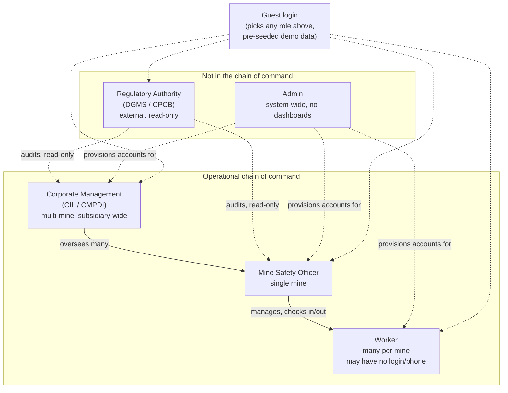
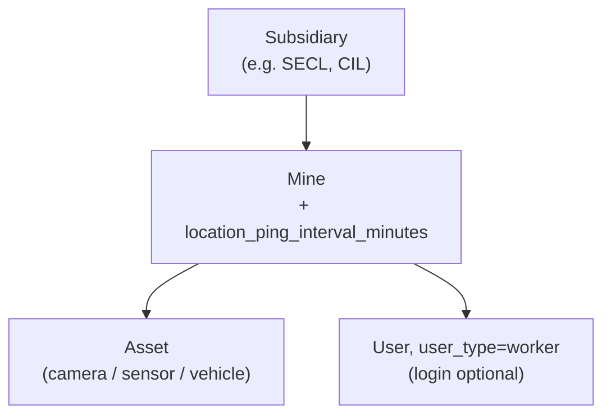

# Low-Level Design — CoalGuard (PS 26024)

> **Last updated:** 2026-09-02 (uncommitted — not yet pushed, exists only in this local working tree) · 
**Status:** CURRENT — source of truth for RBAC, data models, and pages

Full design reference for the team. Builds on `architecture.md`, `plan.md`, `folder_structure.md`, `blockchain_ledger.md`, and `prev_ps.md`. Read this before starting on your part — sections 4–6 are the shared contract everyone codes against; section 7 is the per-feature deep dive.

---

## 1. Features We're Building

Grouped by who mostly owns them, but everything ultimately meets in MongoDB and the `backend` API.

**Identity & access**
- Email/password login, Google OAuth login, and guest login (pick a role, explore with seeded demo data) — Google OAuth is built on both ends but currently switched off in the frontend UI pending a real OAuth Client ID, see `research/saumy/02-google-auth-deferred.md`
- Role-based access control — 5 roles (see §3)

**Field operations**
- Worker attendance — camera-based (face recognition at pit-entry cameras) or manually recorded by the Mine Safety Officer for workers without a phone
- Worker location tracking — periodic GPS ping while checked in, interval configurable per mine (default 5 min)
- Inspections & observations — geo + timestamp auto-captured, photos, voice notes (multilingual speech-to-text) with offline queue and auto-sync
- CAPA ticket lifecycle — open → in_progress → resolved, with escalation on SLA breach; tickets are created automatically (from a Violation or PPE detection) or manually by a Mine Safety Officer
- Live voice chat between a Worker and their Mine Safety Officer for real-time field communication
- Global search across mines, tickets, inspections, and workers

**Live monitoring**
- WebSocket telemetry simulator — simulated IoT sensor stream (methane/CO ppm, air velocity, temperature, roof bolt tension, conveyor speed, vehicle movement), including a **live gas-leak simulation** that spikes methane/CO readings at a mine to trigger the alert pipeline end-to-end
- GIS mine map — 2D Leaflet, hazard pins, risk heatmap, EC boundary, live worker positions
- PPE compliance scanner — YOLOv8 detects missing hardhats/vests from camera feeds, auto-generates a ticket

**Intelligence**
- RAG legal compliance engine — DGMS/CPCB/CMR2017 rulebooks vectorized in ChromaDB; a chat interface answers compliance questions with a cited rule number; auto-maps flagged observations to the matching rule
- Predictive analytics — anomaly detection on historical logs, EC extraction-cap breach forecasting (~30 days out), spatial risk heatmap
- OCR document digitization — legacy paper logbooks/attendance sheets digitized via EasyOCR/Tesseract

**Automation & integrity**
- n8n automated workflows — dispatches SMS/WhatsApp/email on high-severity tickets, escalates unresolved tickets past their SLA, emails scheduled weekly/daily/monthly/quarterly/annual compliance reports depending on template
- Cryptographic audit ledger — SHA-256 hash of each ticket/inspection written to a Solidity smart contract on a public testnet, so records can't be silently altered or deleted from MongoDB
- Compliance certificates — generated per mine, with a QR code for verification and a valid/expired/under-review status, viewable by Regulatory Authority

**Governance dashboards**
- Single-mine dashboard (Mine Safety Officer)
- Multi-mine aggregate dashboard (Corporate Management)
- Read-only cross-mine audit view (Regulatory Authority)
- Admin console (mine/user onboarding, system health monitoring)

---

## 2. Tech Stack

| Layer | Choice |
| --- | --- |
| Frontend | React + Vite + TypeScript, Tailwind CSS, Zustand (state), Apache ECharts (charts), Leaflet.js / react-leaflet (GIS) |
| Backend API | Python, FastAPI, Uvicorn, WebSockets |
| Backend ODM | Beanie (async ODM over Motor/PyMongo) |
| Auth | `python-jose` (JWT), `passlib[bcrypt]` (local passwords), Google OAuth (ID token verification) |
| Primary DB | MongoDB 7 |
| Cache / pub-sub | Redis |
| Vector DB | ChromaDB |
| AI/RAG | LangChain (`langchain-chroma`, `langchain-groq`), HuggingFace `sentence-transformers` (`all-MiniLM-L6-v2`, CPU) for embeddings, Groq Cloud (`llama`/`gpt-oss` models) for the LLM — **already built**, see §7i |
| Predictive Analytics | scikit-learn `IsolationForest` (anomaly detection), NumPy/pandas linear-trend regression (production forecasting) — **already built**, see §7l |
| Computer Vision | YOLOv8 (Ultralytics), OpenCV, PyTorch (CPU-only build — no GPU in any container) |
| OCR | EasyOCR / Tesseract |
| Voice / Speech | Web Speech API (browser STT/TTS) or Bhashini/Sarvam AI (Indian-language STT) for multilingual voice notes; a WebSocket channel carries live Worker↔Officer voice/text chat |
| Workflow automation | n8n (webhooks, SMTP, Twilio API) |
| Blockchain | Solidity + Hardhat (contract dev/test), `web3.py` (backend integration), Polygon testnet |
| Infra | Docker + Docker Compose (BuildKit cache mounts), single VPS or Oracle Cloud free tier for prod, Vercel for the frontend |

`backend` and `ai_engine` are deliberately separate services/containers — the web backend (users, auth, tickets, WebSockets) needs to stay light and responsive; PyTorch/YOLOv8/LangChain are heavy and CPU-blocking, so they live in `ai_engine` and get called over HTTP.

---

## 3. User Roles (RBAC)

5 roles, one dashboard/scope each — guest login (§7a) covers demo access, so there's no separate evaluator/demo role.

| Role | Scope | Key features |
| --- | --- | --- |
| **Worker** | Assigned mine — many per mine | Log inspections/observations, voice-to-text notes, offline queue + auto-sync, own inspection history, background location ping while on shift |
| **Mine Safety Officer** | One mine | Site dashboard, live telemetry + camera feeds, ticket board (assign/resolve), manage Workers, trigger manual inspections, manually check phone-less Workers in/out, set the mine's location-ping interval |
| **Corporate Management** (CIL/CMPDI) | Subsidiary (multi-mine) | Aggregated compliance scores, production-vs-EC-cap ratios across mines, financial penalty metrics, manage Mine Safety Officers, weekly report distribution list |
| **Regulatory Authority** (DGMS/CPCB) | Cross-mine, read-only | Verified audit logs, statutory compliance certificates, historical incident timelines, blockchain hash verification |
| **Admin** | Global | Onboard mines/subsidiaries, create/deactivate users, assign roles, no operational dashboards |

### Role hierarchy



Solid arrows = real chain of command. Dotted arrows = oversight/administration relationships outside that chain — a regulator audits everyone but manages no one, Admin provisions everyone but operates nothing, Guest is a login mechanic rather than a role of its own.

### Auth

JWT (`python-jose`) with `user_type` + `mine_id`/`subsidiary_id` claims; `passlib[bcrypt]` for local password hashing. Three ways to obtain a token:
- **In-house**: email/password against `User.password_hash`.
- **Google OAuth**: frontend gets a Google ID token, backend verifies it and matches an existing invited `User.email` (does not self-provision a new account for an unrecognized email — an Admin must invite first, see §7p). Built on both ends, but the frontend button is currently disabled by a flag pending a real OAuth Client ID — see `research/saumy/02-google-auth-deferred.md`.
- **Guest**: "continue as guest" logs into a pre-seeded demo `User` for whichever user type is picked.

A phone-less Worker has no `password_hash`/`google_id` and simply can't authenticate — they still exist as a full document so attendance, tickets, and certifications can reference them, and the Mine Safety Officer acts on their behalf for check-in/out.

Every query in `backend/src/services` filters by the caller's scope (`mine_id`/`subsidiary_id`) except Admin/Regulatory Authority, which see everything.

---

## 4. MongoDB Models (Beanie Documents)

Hierarchy: `Subsidiary -> Mine -> {Asset, User(user_type=worker)}`.

`Worker` is **not** a separate collection from `User` — a Worker is just a `User` with `user_type="worker"`. Some Workers have no phone and never log in, but still need a real document to attach attendance, certifications, and ticket assignment to. One collection avoids syncing two records for the same person.



### Org & identity
- **`Subsidiary`** — `name`, `code` (e.g. SECL, CIL)
- **`Mine`** — `subsidiary_id`, `name`, `boundary_geojson`, `ec_annual_cap_tonnes`, `ec_monthly_cap_tonnes`, `location_ping_interval_minutes` (int, default `5`, editable by the mine's Safety Officer, applies uniformly to every Worker checked in at that mine)
- **`Asset`** — `mine_id`, `type` (camera / sensor / vehicle / conveyor), `label`, `install_date`, `last_maintenance_at`
- **`User`** — `email` (nullable — phone-less Workers have none), `password_hash` (nullable), `google_id` (nullable), `user_type`, `mine_id` (nullable for Corporate/Admin/Regulator), `subsidiary_id` (nullable), `full_name`, `role_title` (Workers only), `is_guest`, `has_login: bool`, `active`

### Telemetry, CV & attendance
- **`TelemetryReading`** — `mine_id`, `asset_id`, `sensor_type` (methane / co / air_velocity / aqi / noise / water_ph / temperature / roof_bolt_tension / conveyor_speed), `value`, `unit`, `recorded_at` — high-volume, index on `(mine_id, sensor_type, recorded_at)`
- **`PPEDetectionEvent`** — `camera_asset_id`, `mine_id`, `missing_ppe: [str]`, `confidence`, `image_url`, `detected_at`, `linked_ticket_id`
- **`LocationPing`** — `mine_id`, `worker_id` (`User._id`), `lat`, `lng`, `recorded_at` — one row every `Mine.location_ping_interval_minutes`, only while checked in; powers the live "where is everyone" layer on `MineMap`

### Inspections & compliance
- **`Inspection`** — `mine_id`, `source` (manual / sensor / cv), `worker_id` (`User._id`, always a Worker with a login), `observations: [Observation]` (embedded: `description`, `photo_urls`, `voice_note_url`, `lat`, `lng`, `pillar`), `created_at`
- **`Violation`** — `inspection_id` or observation index, `pillar` (safety/environment/production/labour), `compliance_status` (COMPLIANT / NON_COMPLIANT / REVIEW_REQUIRED, from `ai_engine`), `analysis` (LLM-generated explanation text), `citations: [ {source, page, content_excerpt, relevance_score} ]` (embedded, taken directly from `ai_engine`'s `/api/rag/check-compliance` response), `applicable_regulations: [str]`, `created_at` — no separate rule catalog to keep in sync; `ai_engine`'s ChromaDB store is the only source of truth for rule text (see §7i)
- **`Ticket`** (CAPA) — `mine_id`, `source` (violation / cv_detection / manual), `violation_id` (nullable — unset for a manually-filed ticket), `created_by` (nullable `User._id`, set when a Mine Safety Officer files a ticket directly rather than it being auto-generated), `severity`, `status` (open/in_progress/resolved/escalated), `assigned_to` (`User._id`, user_type=worker, nullable if the Safety Officer resolves it themselves), `sla_deadline`, `resolution_photo_urls`, `resolution_notes`, `resolved_by` (`User._id`), `escalation_history: [ {to, at} ]`, `comments: [ {author_id, text, at} ]` (embedded discussion thread)

### Production, environment, labour & attendance logs
- **`ProductionLog`** — `mine_id`, `date`, `extracted_tonnes`
- **`EnvironmentLog`** — `mine_id`, `date`, `aqi`, `noise_db`, `water_discharge_ph`, `dust_suppression_runs`, `topsoil_preservation_pct` (percentage of cleared area with topsoil preserved/restored, an EC compliance metric)
- **`LabourShift`** (doubles as the attendance record) — `worker_id`, `mine_id`, `check_in_at`, `check_in_method` (camera / manual), `check_in_camera_asset_id` (nullable), `check_in_confidence` (nullable), `check_in_recorded_by` (nullable `User._id`, the Safety Officer — only set for manual check-in), `check_out_at`, `check_out_method`, `check_out_recorded_by`, `rest_period_ok: bool`
- **`HealthCheckup`** — `worker_id`, `date`, `result`, `next_due_at`

### Integrity, automation, misc
- **`AuditLedgerEntry`** — `ticket_id` or `inspection_id`, `report_hash` (SHA-256), `tx_hash`, `block_number`, `chain` (polygon-testnet), `logged_at`
- **`AlertLog`** — `ticket_id`, `channel` (sms/whatsapp/email), `recipient`, `sent_at`, `escalation_level`
- **`ScheduledReport`** — `subsidiary_id` or `mine_id`, `template` (daily_shift / weekly_compliance / monthly_environmental / quarterly_safety / annual_statutory), `period_start`, `period_end`, `pdf_url`, `recipients`, `generated_at`
- **`OCRDocument`** — `mine_id`, `doc_type` (logbook/attendance), `raw_image_url`, `extracted_text`, `uploaded_by`, `uploaded_at`
- **`ComplianceCertificate`** — `mine_id`, `pillar` (safety/environment/production/labour), `status` (valid/expired/under_review), `issued_at`, `expires_at`, `qr_code_url`, `document_url` — viewable by Regulatory Authority (§6 `Certificates` page)

---

## 5. Backend (`backend/src`)

```
backend/src/
├── routes/         # FastAPI route/endpoint definitions — thin, validate input, call a service, return
├── schemas/        # Pydantic request/response DTOs — distinct from models/, these aren't DB documents
├── models/         # Beanie Documents from §4, one file per collection
├── services/       # business logic — every query here filters by caller's mine_id/subsidiary_id
├── websockets/      # telemetry simulator + broadcaster, notification push
├── auth/           # JWT issuance/verification, Google OAuth verification, guest login, RBAC dependency
└── main.py         # FastAPI app, lifespan (Mongo/Redis connections), router registration
```

**Auth flow**: a FastAPI dependency (`get_current_user`) decodes the JWT on every request, loads scope (`mine_id`/`subsidiary_id`) from its claims, and every service function takes that scope as a required argument rather than trusting a client-supplied `mine_id` in the request body/query — this is what makes RBAC enforcement structural instead of a checklist.

**Cross-service calls** (`backend` never runs heavy AI code itself):
- `ai_engine` (RAG, YOLOv8 PPE detection, predictive analytics, OCR — RAG/CV/predictive already built, see §7i/§7j/§7l) — plain HTTP calls from `backend/src/services` to its REST endpoints (`/api/rag/check-compliance`, `/api/cv/detect`, `/api/predictive/anomaly`, `/api/predictive/forecast`); results come back as JSON, get written to Mongo by `backend`.
- `n8n` — `backend` fires a webhook (ticket created/escalated) with the ticket payload; n8n owns the actual SMS/WhatsApp/email/escalation logic.
- Blockchain — `backend/src/services/audit.py` computes the SHA-256 hash and calls `web3.py` against the Hardhat-deployed contract's ABI, then writes the resulting `tx_hash`/`block_number` into `AuditLedgerEntry`.

**WebSockets**: one endpoint streams simulated `TelemetryReading`s per mine (including the gas-leak simulation spike), another pushes ticket/alert notifications to connected dashboards. Redis pub/sub is the fan-out mechanism if more than one backend replica is ever running.

**Background/scheduled work**: `ScheduledReport` generation (one job per template — daily/weekly/monthly/quarterly/annual, §7o) and SLA-escalation checks run as periodic jobs (APScheduler in-process for the hackathon scale, or an n8n cron trigger calling a backend endpoint — pick whichever is less code once someone's actually building it).

---

## 6. Frontend Pages (`frontend/src/pages`)

**Landing**
- `Landing` — pre-login marketing/overview page (no auth required), links into `Login`

**Auth**
- `Login` — email/password, Google OAuth, and a "continue as guest" role picker

**Shared shell** — role-aware sidebar/topbar, notifications dropdown (WebSocket-driven), global search (mines/tickets/inspections/workers)

**Dashboards** (same route, content varies by role)
- `Dashboard` — Safety Officer: single-mine KPIs; Corporate: multi-mine aggregate; Regulator: read-only cross-mine

**Operations**
- `MineMap` — Leaflet GIS (2D): hazard pins, risk heatmap, EC boundary, live Worker position layer
- `LiveTelemetry` — real-time charts per sensor type (WebSocket), including the simulated gas-leak spike
- `Tickets` — CAPA board (kanban by status), filterable by mine/severity/pillar
- `TicketDetail` — violation + citation, assignment, proof upload, sign-off, escalation history, comment thread
- `NewTicket` — Mine Safety Officer manually files a ticket (mine/location, category, description, photos) without going through the inspection pipeline
- `Inspections` — list, filter by source/date
- `InspectionDetail` — observations, photos, voice note playback, map pin
- `NewInspection` — mobile-first form (Worker), offline-capable
- `PPEAlerts` — CV detection feed with camera snapshots
- `Attendance` — Safety Officer view: today's check-in/out per Worker, manual check-in/out for phone-less Workers, mine's `location_ping_interval_minutes` setting

**Compliance**
- `ComplianceOverview` — four pillar tabs (Safety/Environment/Production/Labour)
- `ProductionVsCap` — extraction trend vs EC monthly/annual caps, 30-day breach forecast
- `EnvironmentLogs` — AQI/noise/water/dust history
- `Labour` — shifts, rest-period compliance, certifications, health checkups
- `LegalAssistant` — RAG chat: ask a compliance question, get an answer grounded in a cited DGMS/CPCB clause

**Integrity & reporting**
- `AuditLedger` — verify a ticket's hash against the on-chain record
- `Certificates` — compliance certificates per mine/pillar, QR verification, valid/expired/under-review status (Regulatory Authority)
- `Reports` — scheduled report history by template (daily/weekly/monthly/quarterly/annual), download

**Admin / management**
- `Mines` — CRUD mines and assets (Admin, Corporate)
- `Users` — invite/manage users, assign roles (Admin)
- `SystemHealth` — Docker container, Redis, and MongoDB connection status (Admin)
- `Settings` — profile, password, language preference

**Mobile (PWA) specific**
- `SyncStatus` — offline inspection queue, pending upload count

---

## 7. Features Explained in Detail

### a) Login / Auth
Three entry points on `Login`, all producing the same JWT shape:
1. **Email/password** — `POST /auth/login`, backend verifies against `passlib` bcrypt hash, issues JWT with `user_type`/`mine_id`/`subsidiary_id` claims.
2. **Google OAuth** — frontend runs Google's sign-in flow, gets an ID token, sends it to `POST /auth/google`; backend verifies the token's signature against Google's public keys and matches an existing `User.email` (an Admin must have already invited that email — see §7p; an unrecognized email is rejected, not auto-created). **Currently disabled in the frontend** (`GOOGLE_AUTH_ENABLED = false` in `Login.tsx`) — fully built on both ends, just not exposed in the UI until a real Google Cloud OAuth Client ID replaces the placeholder/misconfigured value. See `research/saumy/02-google-auth-deferred.md` for why and how to re-enable it.
3. **Guest** — `POST /auth/guest` with a chosen user type, backend logs into a pre-seeded demo account for that type. No password involved.

All three return the same JWT; the frontend stores it and attaches it as a Bearer token. RBAC scoping happens entirely from the claims inside the token — the frontend never sends `mine_id` for the backend to trust.

### b) Mine Setup
Admin-only. Creating a `Mine` includes drawing/uploading its `boundary_geojson`. Assets (cameras, sensors) get created afterward, tagged directly to that mine (`mine_id`).

### c) Attendance
A `LabourShift` document is both the shift record and the attendance record. Two ways it gets created:
- **Camera**: a pit-entry camera (`Asset.type=camera`) runs face recognition in `ai_engine`; on a match it calls back to `backend`, which writes `check_in_method=camera`, `check_in_camera_asset_id`, `check_in_confidence`.
- **Manual**: for a Worker with no phone, the Mine Safety Officer opens the `Attendance` page and checks them in/out directly; `check_in_method=manual`, `check_in_recorded_by=<officer's User._id>`.
Check-out mirrors check-in. `rest_period_ok` is computed by comparing consecutive shifts for the same worker against the labour-law minimum rest period.

### d) Location Tracking
While a Worker has an open `LabourShift` (checked in, not yet checked out), their device sends a location ping every `Mine.location_ping_interval_minutes` (default 5, same interval for every Worker at that mine, editable by the Safety Officer from the `Attendance` page). Each ping is a `LocationPing` document. Not-checked-in Workers never ping. `MineMap` reads the latest ping per worker to render live position dots.

### e) Inspections & Observations
A Worker with the app opens `NewInspection`: device geolocation and a timestamp are captured automatically, they add one or more `Observation`s (description, photos, optional voice note), tag a `pillar` (safety/environment/production/labour), and submit. If offline, the entry queues locally (IndexedDB/SQLite) and syncs when connectivity returns — the `SyncStatus` page shows what's pending. This is worker-submitted only; phone-less Workers don't submit inspections (only attendance is proxied, per §3/§4 decision).

### f) CAPA Tickets
A `Ticket` is created three ways: from a `Violation` (RAG-mapped from an inspection observation), directly from a `PPEDetectionEvent`, or manually — a Mine Safety Officer files one from `NewTicket` (mine/location, category, description, photos) without an inspection behind it, setting `source=manual` and `created_by`. Lifecycle: `open` → Safety Officer assigns to a Worker (`assigned_to`) or takes it themselves → `in_progress` → resolution photos + notes submitted → `resolved` (`resolved_by` set). If `sla_deadline` passes unresolved, status flips to `escalated` and an entry is appended to `escalation_history`, which also fires the n8n escalation workflow (§7k). Anyone with access to the ticket can append to its `comments` thread at any status.

### g) Live Telemetry Simulation
A backend WebSocket endpoint generates simulated `TelemetryReading`s per mine at a steady interval for the normal sensor types. The **gas-leak simulation** is a special trigger (manual button in a demo/admin context, or a scheduled scenario) that injects a sharp methane/CO spike for a mine — this is what proves the whole pipeline live: spike → hazard pin appears on `MineMap` → ticket auto-created → n8n alert dispatched, all within the demo.

### h) Mine Map & GIS
`MineMap` renders `Mine.boundary_geojson` and the EC boundary, with layers for hazard pins (from active tickets), a risk heatmap (from predictive analytics, §7l), and live Worker positions (from `LocationPing`). 2D Leaflet was chosen over a 3D engine (e.g. Mapbox GL) for build-cost reasons.

### i) RAG Legal Compliance Engine
**Already built** in `ai_engine` (`ingest_rag.py` + `rag_engine.py`, merged to `main`) — this describes what exists, not a future build.

**What's built:** `ingest_rag.py` chunks the regulatory PDFs in `ai_engine/data/rulebooks/` (Coal Mines Regulations 2017, CPCB/NAAQS air quality standards, etc.), embeds them locally with HuggingFace `all-MiniLM-L6-v2` (CPU, no API call needed for embeddings), and persists them into a ChromaDB collection (`coal_mine_regulations`). At query time, `ai_engine`'s `POST /api/rag/check-compliance` takes a free-text `observation`, retrieves the 5 most relevant chunks from Chroma, and asks a Groq-hosted LLM for a structured verdict: `compliance_status` (COMPLIANT / NON_COMPLIANT / REVIEW_REQUIRED), a plain-language `analysis`, the regulations it thinks apply, and citations — each naming the **source PDF and page number**. There's no separate rule-number catalog in Mongo; the citation is stored directly on `Violation` (§4).

**What `backend` needs to add:** wire this one existing endpoint into two places — call it with an `Observation.description` to create a `Violation` (store the response as-is, no extra modeling), and call it with the user's typed question for the `LegalAssistant` chat page. Same endpoint both times; the chat page just displays the answer conversationally instead of attaching it to a ticket.

**Worth adding later, not required for MVP:** a lighter, purely conversational endpoint for `LegalAssistant` if the compliance-verdict framing feels awkward for open-ended questions (today, asking "what's required for gas monitoring?" still returns a COMPLIANT/NON_COMPLIANT verdict, which reads a little oddly for a question rather than an observation) — low priority, the existing endpoint already works for both uses.

### j) Computer Vision PPE Scanner
`ai_engine` runs YOLOv8 (Ultralytics, CPU) against camera streams from `Asset.type=camera` at pit entry points, looking for hardhats/hi-vis vests. A detected violation creates a `PPEDetectionEvent` (with the snapshot and confidence) and, above a confidence threshold, auto-creates a `Ticket` — this is the CV-to-CAPA-loop that's a direct callback to the 2025 PS (Smart PPE Compliance Monitoring).

### k) n8n Automated Alerts & Escalation
`backend` fires a webhook to n8n whenever a `Ticket` is created at high severity or flips to `escalated`. n8n workflows (stored as exported JSON in `n8n/workflows/`) handle the actual dispatch — SMS/WhatsApp via Twilio, email via SMTP — and log what was sent back into `AlertLog`. The weekly compliance summary (`ScheduledReport`) is also an n8n cron workflow that calls a backend report-generation endpoint and emails the resulting PDF to the distribution list.

### l) Predictive Analytics
**Already built** in `ai_engine` (`predictive_engine.py`, merged to `main`) — not something to build from scratch, just something `backend` needs to call. In plain terms, it does two things:

1. **A smoke detector for sensor readings.** Given one snapshot of methane, CO, air velocity, and temperature (`POST /api/predictive/anomaly`), it checks each value against hard regulatory limits (e.g. methane above 1.5% is critical) *and* runs a machine-learning model (`IsolationForest`) that's learned what a normal combination of all four readings looks like — so it can also catch a combination that's individually fine but collectively wrong (moderately high on everything at once, say). It returns one of three verdicts — NORMAL, WARNING, or CRITICAL — plus which sensor(s) triggered it. This is exactly what should drive the gas-leak-simulation → ticket pipeline in §7g: call this endpoint per simulated reading rather than re-implementing thresholds in `backend`.
2. **A trend line for production.** Given a mine's daily coal-extraction history (`POST /api/predictive/forecast`), it fits a straight trend line through the past and projects the next 30 days, then checks whether the projected total will cross the mine's EC cap. Returns a day-by-day forecast plus one verdict: COMPLIANT, AT_RISK, or EXCEEDED.

`backend`'s job for both is thin: call the endpoint, store/display the result — `ProductionVsCap` renders the forecast, the anomaly result feeds `MineMap`'s risk heatmap and the ticket-creation flow.

### m) Blockchain Audit Ledger
When a `Ticket` (or `Inspection`) is created or resolved, `backend` computes a SHA-256 hash of its JSON and calls the Hardhat-deployed `AuditLedger.sol` contract via `web3.py` (`logReport`/`resolveReport`), recording the resulting `tx_hash`/`block_number` in `AuditLedgerEntry`. The `AuditLedger` page lets a Regulator re-hash the current MongoDB record and compare it against the on-chain hash — a mismatch proves tampering. *(Open: whether every ticket gets hashed, or only resolved ones, to keep the demo simpler.)*

### n) OCR Document Digitization
A scanned image of a legacy logbook/attendance sheet is uploaded, run through EasyOCR/Tesseract in `ai_engine`, and the extracted text is stored as an `OCRDocument` for search/reference — lowest priority feature.

### o) Scheduled Compliance Reports
A periodic job (§5) assembles a PDF summarizing a mine's or subsidiary's compliance status for the period, using one of five named `template`s — daily shift, weekly compliance, monthly environmental, quarterly safety, annual statutory — each on its own schedule. Stores the result (`ScheduledReport.pdf_url`) and hands off to the matching n8n email workflow (§7k). Viewable/downloadable from the `Reports` page, filterable by template.

### p) Admin / User Management
Admin-only `Users` page: invite a user (sends them a set-password link, or they arrive via Google OAuth on first login), assign a role and scope (`mine_id`/`subsidiary_id`), deactivate accounts. This is the one persona explicitly *not* demoed live in the judge pitch — real onboarding happens once via this page or a seed script before the demo.

### q) Multilingual Voice & Chat
Two distinct things, not one: **voice notes** (already covered, §7e/§4 — an async audio attachment on an `Observation`, transcribed via the Web Speech API or Bhashini/Sarvam AI so a Worker can report in Hindi or a regional language instead of typing) and **live voice/text chat** — a real-time WebSocket channel between a Worker in the field and their Mine Safety Officer, for back-and-forth communication a one-way voice note can't cover (e.g. talking someone through an evacuation). The chat channel doesn't need its own persistent model for MVP — it's transient, routed over the same WebSocket infrastructure as §7g/§5 — persisting a message history is a later add if it turns out to matter.

### r) Global Search
A single search bar in the shared shell queries across mines, tickets, inspections, and workers at once, scoped to the caller's `mine_id`/`subsidiary_id` like everything else (§3 Auth). Backed by a `backend` search endpoint that fans a query out across the relevant collections (`Mine`, `Ticket`, `Inspection`, `User`) rather than a dedicated search index — Mongo text indexes on the key fields are enough at this scale.

### s) Compliance Certificates
A `ComplianceCertificate` is generated per mine per pillar (safety/environment/production/labour), carries a `status` (valid/expired/under_review) and an expiry date, and exposes a `qr_code_url` that resolves to a verification page — the same "prove it wasn't faked" idea as the audit ledger (§7m), but for the certificate document itself rather than a ticket. Regulatory Authority views these on the `Certificates` page; a Corporate/Admin role generates them (exact trigger — manual vs. automatic on a compliance threshold — still open, doesn't block modeling it).

### t) Admin System Health
The `SystemHealth` page gives Admin a one-glance view of infrastructure state — Docker container status per service, Redis connection/hit-rate, MongoDB connection — pulled from each service's own `/health` endpoint (`backend` and `ai_engine` already have one) rather than a new monitoring service. Lowest priority in this list; useful for demo credibility ("we can see our own system is healthy"), not for any user-facing feature.
