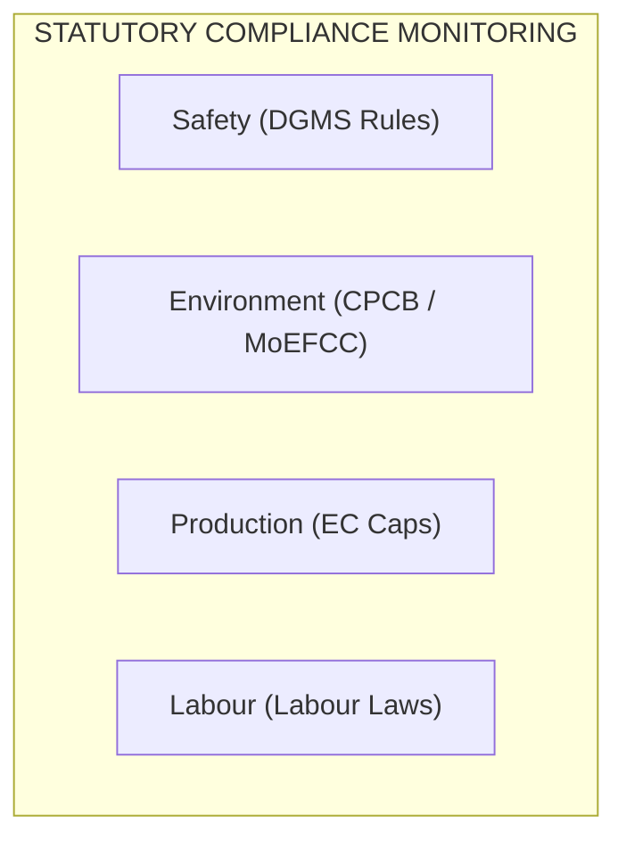
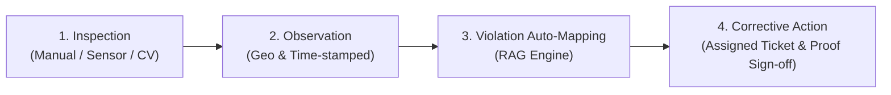
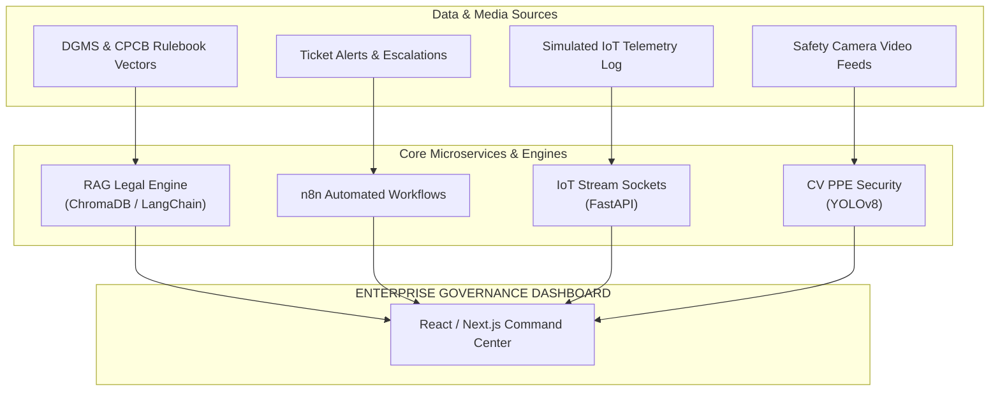
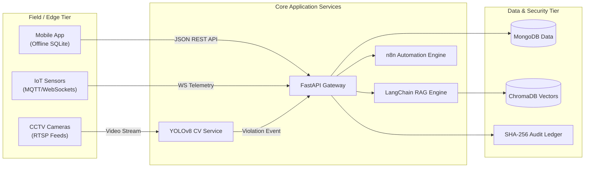

# System Architecture and Implementation Blueprint

## Problem Statement Profile
- **Problem Statement ID:** PS 26024
- **Title:** AI-Based Smart Governance and Compliance Monitoring System for Coal Mines
- **Organization:** Ministry of Coal
- **Category:** Software
- **Theme:** Smart Automation

## 1. Executive Summary
This document details the enterprise technical architecture, software features, and deployment plan for PS 26024. The platform is a smart governance and compliance monitoring system designed to digitize regulatory oversight across four critical operational domains: Safety, Environment, Production, and Labour Regulations.

By integrating real-time IoT telemetry, computer vision safety checks, a Retrieval-Augmented Generation (RAG) legal compliance engine, n8n automated escalation workflows, and an immutable cryptographic audit trail, the platform transitions coal mine management from manual paperwork to an automated, closed-loop governance ecosystem.

## 2. Statutory Pillars and Operational Scope
The solution tracks statutory compliance across four regulatory categories and manages incidents via a closed-loop CAPA (Corrective and Preventive Action) lifecycle.

### Statutory Compliance Matrix
- **Safety (DGMS Guidelines):** Tracks underground gas levels (Methane, CO), ventilation air velocity, roof bolting integrity, equipment maintenance cycles, and safety equipment usage.
- **Environment (CPCB & MoEFCC Rules):** Tracks Air Quality Index (AQI), ambient noise levels, water discharge purity, dust suppression spraying logs, and topsoil preservation.
- **Production (Ministry & EC Limits):** Tracks extraction volume against Environmental Clearance (EC) annual/monthly legal caps.
- **Labour (Labour Regulations):** Enforces 8-hour shift limits, mandatory rest periods, valid worker safety certifications, and health check-up schedules.

### Closed-Loop CAPA Ticket Lifecycle

- **Inspection:** Manual inspector logs or automated sensor/CV diagnostics run across mine zones.
- **Observation:** Anomalies logged with location, timestamp, and context.
- **Violation Auto-Mapping:** The system maps observations directly to statutory rulebooks via RAG.
- **Corrective Action:** Generates high-priority tickets assigned to responsible engineers, requiring photo proof and digital sign-off to resolve.

## 3. Core Software Architecture & Component Breakdown

### 3.1 Web & Mobile Interface

#### Frontend Web Application
- **Tech Stack:** React.js / Next.js, Tailwind CSS, shadcn/ui.
- **Functionality:** Provides a central dark-themed command center for evaluators and mine managers, displaying live mine maps, real-time sensor streams, incident counters, and executive KPI cards.

#### Role-Based Access Control (RBAC)
- **Mine Safety Officer View:** Operates at the site level, displaying live telemetry alerts, pit-level tickets, and camera feeds.
- **Corporate Management View (CIL/CMPDI):** Aggregates multi-mine data, displaying corporate compliance scores, production vs. legal cap ratios, and financial penalty metrics.
- **Regulatory Authority View (DGMS/CPCB):** Read-only portal providing access to verified audit logs, statutory compliance certificates, and historical incident timelines.
- **Evaluator View:** Dedicated interface for SIH evaluators and external auditors to review system capabilities, compliance dashboards, and end-to-end governance workflows.

#### Mobile Inspection Application
- **Tech Stack:** Progressive Web App (PWA) / Flutter, SQLite / IndexedDB.
- **Functionality:** Built for field inspectors working in underground pits. Automatically captures GPS coordinates (Latitude, Longitude) and ISO timestamps for every observation. Supports offline storage when network connectivity is lost, auto-syncing with the central database upon returning above ground.

### 3.2 Real-Time Telemetry & Spatial Mapping

#### GIS Spatial Mapping Engine
- **Tech Stack:** Leaflet.js / Mapbox GL JS, GeoJSON.
- **Functionality:** Renders an interactive satellite view of mine boundaries, processing plants, pit zones, conveyor belt routes, and chemical storage areas. Plots live hazard pins, displays spatial risk heatmaps, and outlines Environmental Clearance (EC) boundary lines.

#### WebSocket Telemetry Simulator
- **Tech Stack:** Python FastAPI, WebSockets.
- **Functionality:** Runs background simulations of live industrial IoT telemetry (gas concentration in ppm, temperature, conveyor belt speeds, vehicle movement) and streams data directly to the web dashboard UI.

### 3.3 Intelligence & Automation Engines

#### RAG Legal Compliance Engine
- **Tech Stack:** ChromaDB / FAISS, LangChain, Llama-3 / Ollama (or Cloud APIs).
- **Functionality:** Vectorizes official legal documents including Coal Mines Regulations (CMR) 2017, DGMS circulars, and CPCB guidelines. When a compliance failure occurs, the engine retrieves exact legal clauses and attaches statutory citations (e.g., "Violation of DGMS Rule 124(2)") to incident tickets.
- **Key Selling Point:** RAG grounds every AI response in actual statutory text, eliminating hallucinations and ensuring every cited rule number and section reference is verifiable against the original legal document.

#### Automated Workflow Engine (n8n)
- **Tech Stack:** n8n (Node-based automation engine), Webhooks, Twilio API, SMTP.
- **Functionality:** Listens for high-severity anomaly webhooks. Automatically dispatches real-time WhatsApp, SMS, and email alerts to safety engineers. Enforces SLA timelines by automatically escalating unresolved tickets to higher management. Emails scheduled weekly compliance summary reports to corporate management and regulatory stakeholders.

#### Predictive Analytics Engine
- **Tech Stack:** Python, scikit-learn (Isolation Forest), Prophet / ARIMA models.
- **Functionality:** Analyzes historical logs to generate spatial risk heatmaps and forecasts future compliance risks. Warns management up to 30 days in advance if current daily extraction velocities will breach annual Environmental Clearance limits.

#### Computer Vision PPE Scanner
- **Tech Stack:** OpenCV, YOLOv8.
- **Functionality:** Processes CCTV video streams at pit entry points to detect personnel missing required PPE (hardhats, high-visibility vests) and automatically generates safety observation tickets.

#### Multilingual Voice Reporting & Chat
- **Tech Stack:** Web Speech API / Bhashini API / Sarvam AI.
- **Functionality:** Provides voice-to-text input via a dedicated microphone button on the mobile app, enabling field personnel and underground workers to record inspection observations verbally in Hindi or regional languages when typing is impractical. Supports voice chat for real-time communication between field inspectors and control room operators.

### 3.4 Data Integrity & Digitization

#### Cryptographic Audit Ledger
- **Tech Stack:** Python hashlib (SHA-256) / Web3 Solidity (Polygon Testnet).
- **Functionality:** Hashes each inspection entry, timestamp, and resolution status into a sequential cryptographic block chain. Guarantees an immutable history, preventing retroactive alteration or deletion of safety records prior to official audits.

#### OCR & Document Digitization Module
- **Tech Stack:** EasyOCR / Tesseract OCR.
- **Functionality:** Digitizes legacy paper logbooks, shift sign-in sheets, and physical attendance registers into structured database entries.

### 3.5 Infrastructure & Deployment

#### Multi-Tenant Database Architecture
- **Tech Stack:** MongoDB / PostgreSQL.
- **Functionality:** Organizes data hierarchically (Subsidiary -> Mine Site -> Pit/Zone -> Asset/Worker) to allow seamless scaling across multiple mine locations.

#### Containerization & Orchestration
- **Tech Stack:** Docker, docker-compose.yml.
- **Functionality:** Packages the frontend, FastAPI backend, MongoDB, ChromaDB vector store, and n8n instance into containerized microservices for single-command deployment across cloud or air-gapped infrastructure.

## 4. Technical Feature Mapping Summary

| System Feature | Primary Tool / Technology | Technical Purpose |
| --- | --- | --- |
| Command Center UI | React / Next.js | Central dashboard display for operational monitoring. |
| Access Control | JWT, RBAC | Custom portal views for Officers, Management, Regulators, and Evaluators. |
| Central Database | FastAPI + MongoDB | Handles backend business logic and primary record storage. |
| Field Mobile App | PWA / Flutter | Geo-tagged and time-stamped inspection reporting. |
| Offline Synchronization | SQLite / IndexedDB | Local inspection data storage for underground environments. |
| Spatial Mapping | Leaflet.js / Mapbox | Interactive mine maps and geographic risk heatmaps. |
| Telemetry Simulation | WebSockets + Python | Real-time live data streaming to dashboard components. |
| Legal Citation Engine | ChromaDB + LangChain | RAG-based lookup of exact DGMS and CPCB legal clauses. |
| Workflow Escalation | n8n Automation Engine | Automated alert dispatch, SLA escalation workflows, and scheduled weekly reports. |
| Predictive Modeling | Prophet / Scikit-learn | Forecasting extraction cap breaches and high-risk zones. |
| PPE Safety Scanner | OpenCV + YOLOv8 | Video detection of missing safety gear at site entrances. |
| Speech-to-Text & Voice Chat | Bhashini / Sarvam AI | Voice-driven inspection reporting and field voice chat in regional languages. |
| Audit Ledger | SHA-256 Hashing | Cryptographically immutable inspection and violation records. |
| Document Processing | EasyOCR / Tesseract | Digitization of physical attendance sheets and legacy logs. |
| System Scalability | Docker Compose | Microservices containerization for deployment across sites. |

## 5. Development Strategy & Deployment Topology

### Data Sourcing Strategy
To seed the system prior to receiving official ministry production feeds, the platform uses public proxy datasets:
- **Data.gov.in:** Open government datasets covering historical coal production, environmental clearance approvals, and industrial accident reports.
- **Regulatory Texts:** Raw PDF documents of Coal Mines Regulations (CMR) 2017, DGMS Circulars, and CPCB Air Quality Standards ingested into vector stores.
- **Kaggle Repositories:** Industrial sensor telemetry logs used to train anomaly detection and generate telemetry streams.

### End-to-End System Data Flow

### Execution Sequence
- **Phase 1:** Configure FastAPI backend, MongoDB schemas, and WebSocket telemetry generator.
- **Phase 2:** Build React command dashboard, integrate Leaflet GIS map, and implement RAG legal retrieval engine.
- **Phase 3:** Set up n8n webhook workflows, SHA-256 audit ledger, YOLOv8 PPE detector, and mobile PWA layout.
- **Phase 4:** Containerize environment using docker-compose.yml and perform end-to-end integration testing.